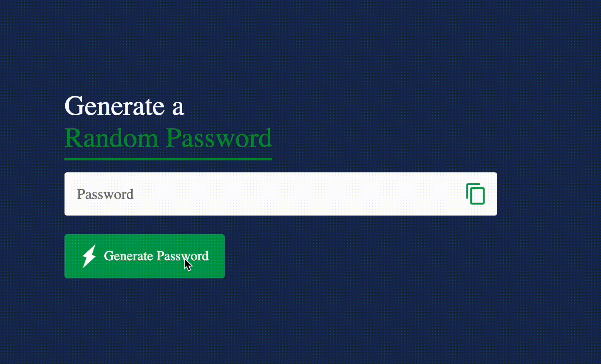

# Password Generator

The **Password Generator** is a simple and efficient web application that allows users to generate strong, random passwords based on selected criteria. It's built using HTML, CSS, and JavaScript and provides a user-friendly interface to customize password length, character types, and more.

## Features

- **Character Options**: Include or exclude uppercase letters, lowercase letters, numbers, and special characters.
- **Instant Password Generation**: Click a button to generate a secure password instantly.
- **Copy to Clipboard**: Easily copy the generated password to the clipboard with a single click.


## Demo



*Click the image above to see the Password Generator in action.*

## Installation and Setup

1. Clone the repository:
   ```bash
   git clone https://github.com/your-username/password-generator.git
